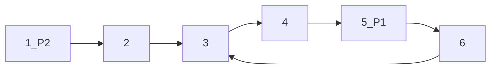

## 面试题21：调整数组顺序是的奇数位于偶数前面

> 题目：输入一个整数数组，实现一个函数来调整改整数中数字的顺序，使得所有奇数位于数组的前半部分，偶数位于后半部分。

思路：设置两个指针一个指向数组头部，一个指向数组尾部。前面遇到偶数，后面遇到奇数时两者交换直到两个数组相遇。

解法：

```C++
#include <iostream>
#include <vector>
#include <string>


using namespace std;
bool isEven(int a)
{
    return (a & 1) ? false : true;
}
//并没有保持原有的数组顺序
bool reorderEven(vector<int> &input)
{
    int length = input.size();
    if(length < 1)return 0;
    int head = 0;
    int tail = length - 1; 
    while(head < tail)
    {
        while( head < tail && !isEven(input[head]))
            head++;
        while( head < tail && isEven(input[tail]))
            tail--;
        if(head < tail){
            int tmp = input[head];
            input[head] = input[tail];
            input[tail] = tmp;
        }
    }
    return 1;
}

int main()
{
	vector<int> target = {1,2,3,5,6,7,8,9};
	cout<<"origin: ";
	for(auto tmp : target)
		cout<<tmp<<' ';
	reorderEven(target);
	cout<<endl<<"result: ";
	for(auto tmp : target)
		cout<<tmp<<' ';
	return 0;
}
```

## 面试题22：链表中倒数第k个节点

> 题目：输入一个链表，输出该链表中倒数第k个节点。（从1开始计算而非0）
>
> 链表结构：
>
> ```C++
> struct listNode
> {
>     int value = 0;
>     listNode* next;
> };
> ```

思路：设置两个头指针，第一个先走k个节点，然后第二个开始一起走，直到第一个走到尾部。

需要注意的边界问题：

1. 输入指针为空指针。
2. 链表的节点数小于k。
3. k小于1。

解法：

```C++
#include <iostream>
#include <vector>
#include <string>


using namespace std;

struct listNode
{
	int value = 0;
	listNode* next;
	listNode(int a):value(a){};
};

listNode* findKthToTail(listNode* head,int k)
{
    if(head == nullptr)return nullptr;
    if(k < 1)return nullptr;
    listNode* first = head;
    listNode* second = head;
    int count = 0;
    while(first != nullptr)
    {
        first = first->next;
        if(count == k)
        {
            second = second->next;
        }
        else
        {
            count++;
        }
    }
    if(count == k)
        return second;
    return nullptr;
}

int main()
{
	int tmp[9] = {1,2,3,4,5,6,7,8,9};
	
	listNode* head = new listNode(0);
	listNode* iterator1 = head;
	for(int i = 0 ;i < 9;i ++)
	{	
		iterator1->next = new listNode(tmp[i]);	
		iterator1 = iterator1->next;		
		iterator1->next = nullptr;
	}
	listNode* iterator = head;
	cout<<"origin: ";
	while(iterator != nullptr)
	{
		cout<< (iterator->value) <<" ";
		iterator = iterator->next;
	}	
	listNode* result = findKthToTail(head,7);
	if(result != nullptr)
		cout<<endl<<"result: "<< result->value <<endl;
	else cout<<endl<<"error";
	return 0;
}
```

## 面试题23：链表中环的入口节点

> 题目：如果一个链表中包含环，如何找到换的入口节点？

思路：首先判断链表是否有环，方法是设置两个迭代速度不同的指针，第一个每次加1，第二个每次加2。如果存在环，则两者会相遇。

把相遇的节点存储，然后从这里再次遍历一次，即可得到环的节点数n。

然后设置两个指针，速度相同，第一个指针先向前n次，之后两个指针一起遍历，相遇的节点即环的入口节点。



如图所示：环的节点数为4，P1先移动4步，然后一起移动会在入口处相遇（因为两者的距离始终是n）。

解法：

```C++
//检测是否有环，并且返回相遇节点
listNode* meetNode(listNode* head)
{
    if(head == nullptr)return nullptr;
    //设置快慢的两个指针，并让其先运动一次
    listNode* slow = head->next;
    if(slow == nullptr)return nullptr;
    listNode* fast = slow->next;
    while(fast != nullptr)
    {
        if(fast == slow)
            return fast;
        fast = fast->next;
        //需要注意边界条件，while只能保证当前节点不是空指针，不能保证下下个节点不是空指针
        if(fast != nullptr)
            fast = fast->next;
        slow = slow->next;
    }
    return nullptr;       
}

listNode* getEntryNode(listNode* head)
{
    if(head == nullptr)return nullptr;
    listNode* meet = meetNode(head);
    if(meet == nullptr)return nullptr;
    //环节点数，至少1个
    int count = 1;
    listNode* tmp = meet->next;
    while(tmp != meet)
    {
        cout++;
        tmp = tmp->next;
    }
    listNode* P1 = head;
    listNode* P2 = head;
    for(int i = 0;i < count;i++)
    {
        P1 = p1->next;
    }
    
    while(p1 != p2)
    {
        p1 = p1->next;
        p2 = p2->next;
    }
    return p1;    
}
```

## 面试题24：反转链表

> 题目：定义一个函数，输入一个链表的头节点，反转该链表并输出反转后链表的头节点。

思路：从头遍历链表，并以相反的方向重新组成链表。需要维持三个节点：当前节点，它的前一个节点和后一个节点。

解法：

```C++
#include <iostream>
#include <vector>
#include <string>

using namespace std;

struct listNode
{
	int value = 0;
	listNode* next;
	listNode(int a):value(a){};
};

listNode* reverseList(listNode* head)
{
    if(head == nullptr)return nullptr;
    if(head->next == nullptr)return head;
    
    listNode* cur = head;
    listNode* reverseHead = nullptr;
    listNode* pre = nullptr;
    
    while(cur != nullptr)
    {
        //中间变量，记录下一个节点
        listNode* nex = cur->next;        
        //记录反转的头节点
        if(nex == nullptr)
            reverseHead = cur;
        //反转指向
       	cur->next = pre;
        //pre和cur向前进一
        pre = cur;
        cur = nex;                
    }
    return reverseHead;
}

int main()
{
	int tmp[9] = {1,2,3,4,5,6,7,8,9};
	
	listNode* head = new listNode(0);
	listNode* iterator1 = head;
	for(int i = 0 ;i < 9;i ++)
	{	
		iterator1->next = new listNode(tmp[i]);	
		iterator1 = iterator1->next;		
		iterator1->next = nullptr;

	}
	listNode* iterator = head;
	cout<<"origin: ";
	while(iterator != nullptr)
	{
		cout<< (iterator->value) <<" ";
		iterator = iterator->next;
	}	
	listNode* result = reverseList(head);
	cout<<endl<<"result: ";
	if(result != nullptr)
		while(result != nullptr)
		{
			cout<< (result->value) <<" ";
			result = result->next;
		}	
	else cout<<endl<<"error";
	return 0;
}
```

## 面试题25：合并两个排序的链表

> 题目：输入两个递增排序的链表，合并这两个链表并使新链表中节点任然是递增排序的。

思路：两者进行对比，小的节点作为头节点，循环递归。需要注意边界条件。

解法：

```C++
//递归解法
listNode* mergeList(listNode* head1,listNode* head2)
{
    if(head1 == nullptr)return head2;
    else if(head2 == nullptr)return head1;
    
    listNode* mergeHead = nullptr;
    
    if(head1->value < head2->value)
    {
        mergeHead = head1;
        mergeHead ->next = mergeList(head1->next,head2);
    }
    else
    {
        mergeHead = head2;
        mergeHead ->next = mergeList(head1,head2->next);        
    }
    return mergeHead;
}

```

## 面试题26：树的子结构

> 输入两棵二叉树A和B，判断B是不是A的子结构。二叉树节点的定义如下：
>
> ```C++
> struct binaryTreeNode
> {
>     double value;
>     binaryTreeNode* left;
>     binaryTreeNode* right;
> }
> ```

思路：先遍历A找到B的根节点，然后进行对比，使用递归即可。

1. 浮点数的对比不能使用“==”，因为计算机存储浮点数用的是近似值，为的是能在固定长度上存储更大范围的数。
2. 需要随时注意空指针。

解法：

```C++
//比较节点中浮点数是否相等
bool isEqual(binaryTreeNode* tree1,binaryTreeNode* tree2)
{
    double diff = tree1->value - tree2->value;
    if(diff < 0.0000001 && diff > -0.0000001)
        return true;
    else
        return false;        
}
//验证tree2是否是tree1的子节点（假设两者root相同）
bool doesTree1HaveTree2(binaryTreeNode* tree1,binaryTreeNode* tree2)
{
    //递归结束条件
    if(tree2 == nullptr)return true;
    if(tree1 == nullptr)return false;
    
    if(!isEqual(tree1,tree2))return false;
    bool result = doesTree1HaveTree2(tree1->left,tree2->left)
        && doesTree1HaveTree2(tree1->right,tree2->right);
    
    return result;    
}
//验证tree2是否是tree1的子节点（在tree1中寻找tree2的root）
bool hasSubtree(binaryTreeNode* tree1,binaryTreeNode* tree2)
{
    bool result = false;
    //时刻保证不为空指针
    if(tree1 != nullptr && tree2 != nullptr)
    {
        if(isEqual(tree1,tree2))
        {
            result = doesTree1HaveTree2(tree1,tree2);
        }
        //如果result为真，则结束递归
        if(!result){
            result = hasSubtree(tree1->left,tree2);
        }
        if(!result){
            result = hasSubtree(tree1->right,tree2);
        }    
    }
    return result;    
}
```

## 面试题27：二叉树的镜像（二叉树翻转）

> 题目：输入一个儿茶叔，输出它的镜像，二叉树节点定义如下：
>
> ```C++
> struct binaryTreeNode
> {
>     double value;
>     binaryTreeNode* left;
>     binaryTreeNode* right;
> }；
> ```

思路：递归交换左右节点。

解法：

```C++
void reverseBinaryTree(binaryTreeNode* root)
{
    if(root == nullptr)return ;
    
    if(root->left == nullptr && root->right == nullptr)
    	return ;
    binaryTreeNode* tmp = root->left;
    root->left = root->right;
    root->right = tmp;
    
    if(root->left)reverseBinaryTree(root->left);
    if(root->right)reverseBinaryTree(root->right);    
}
```

测试代码：

```C++
#include <iostream>
#include <vector>
#include <string>
#include <queue>
#include <sstream>
#include <algorithm>

using namespace std;

struct binaryTreeNode
{
    int value;
    binaryTreeNode* left;
    binaryTreeNode* right;
	binaryTreeNode(int x) : value(x), left(NULL), right(NULL) {}
};

void reverseBinaryTree(binaryTreeNode* root)
{
    if(root == nullptr)return ;
    
    if(root->left == nullptr && root->right == nullptr)
    	return ;
    binaryTreeNode* tmp = root->left;
    root->left = root->right;
    root->right = tmp;
    
    if(root->left)reverseBinaryTree(root->left);
    if(root->right)reverseBinaryTree(root->right);    
}

void prettyPrintTree(binaryTreeNode* node, string prefix = "", bool isLeft = true) {
    if (node == nullptr) {
        cout << "Empty tree";
        return;
    }

    if(node->right) {
        prettyPrintTree(node->right, prefix + (isLeft ? "|   " : "    "), false);
    }

    cout << prefix + (isLeft ? "`-- " : ",-- ") + to_string(node->value) + "\n";

    if (node->left) {
        prettyPrintTree(node->left, prefix + (isLeft ? "    " : "|   "), true);
    }
}
void trimLeftTrailingSpaces(string &input) {
    input.erase(input.begin(), find_if(input.begin(), input.end(), [](int ch) {
        return !isspace(ch);
    }));
}

void trimRightTrailingSpaces(string &input) {
    input.erase(find_if(input.rbegin(), input.rend(), [](int ch) {
        return !isspace(ch);
    }).base(), input.end());
}

binaryTreeNode* stringTobinaryTreeNode(string input) {
    trimLeftTrailingSpaces(input);
    trimRightTrailingSpaces(input);
    input = input.substr(1, input.length() - 2);
    if (!input.size()) {
        return nullptr;
    }

    string item;
    stringstream ss;
    ss.str(input);

    getline(ss, item, ',');
    binaryTreeNode* root = new binaryTreeNode(stoi(item));
    queue<binaryTreeNode*> nodeQueue;
    nodeQueue.push(root);

    while (true) {
        binaryTreeNode* node = nodeQueue.front();
        nodeQueue.pop();

        if (!getline(ss, item, ',')) {
            break;
        }

        trimLeftTrailingSpaces(item);
        if (item != "null") {
            int leftNumber = stoi(item);
            node->left = new binaryTreeNode(leftNumber);
            nodeQueue.push(node->left);
        }

        if (!getline(ss, item, ',')) {
            break;
        }

        trimLeftTrailingSpaces(item);
        if (item != "null") {
            int rightNumber = stoi(item);
            node->right = new binaryTreeNode(rightNumber);
            nodeQueue.push(node->right);
        }
    }
    return root;
}

int main()
{
	string tmp = "[1,2,3,5,4,6,7,8,5]";
	binaryTreeNode* root =  stringTobinaryTreeNode(tmp);
	prettyPrintTree(root,"",true);
	reverseBinaryTree(root);
	cout<<"result: "<<endl;
	prettyPrintTree(root,"",true);

}
```


## 面试题28：对称的二叉树

> 题目：实现一个函数，用来判断一棵二叉树是不是对称的。如果一棵二叉树和它的镜像一样，那么它就是对称的。

思路：通过对比二叉树的前序遍历序列和对称前序遍历序列来判断二叉树是不是对称的。

解法：

```C++
bool isSymmetry(binaryTreeNode* root)
{
    return isSymmetry(root,root);
}

bool isSymmetry(binaryTreeNode* root1,binaryTreeNode* root2)
{
    //对称条件应该是一直到所有的空节点
    if(root1 == nullptr && root2 == nullptr)
        return true;
    if(root1 == nullptr || root2 == nullptr)
        return false;
    //所以这里应该需要判断不相等来终止遍历，而不是判断相等（无法检查）
    if(root1->value != root2->value)
        return false;    
    
    return isSymmetry(root1->left,root1->right) &&
        isSymmetry(root1->right,root1->left); 
}
```

## 面试题29：顺时针打印矩阵

> 题目：输入一个矩阵，按照从外向里以顺时针的顺序依次打印出每一个数字。

思路：首先把顺时针打印分解为一圈一圈的打印，起点为左上角的点。然后分析打印结束的条件：即左上角在中心的左上。
然后再把每一圈分为四个步骤，从左到右打印一行，从上到下打印一列，从右到左打印一行，从下到上打印一列。每一步根据起始和终止坐标进行循环打印。
需要注意的是最后一圈，打印步骤不全。
1. 第一步总是需要的，因为打印一圈至少有一步。
2. 第二步的前提条件是终止行号大于起始行号。
3. 第三步的前提条件是圈内至少还有两行两列。
4. 第四步的前提条件是圈内至少还有三行两列。

解法：
```C++
#include <iostream>
#include <vector>
#include <string>
#include <algorithm>

using namespace std;

void printMatrixCircle(vector<vector<int>> input , int count)
{
	int rows = input.size();
    int cols = input[0].size();

    int endX = cols - 1 - count;
    int endY = rows - 1 - count;
    //从左到右打印一行
    for( int i = count; i <= endX;i++)
    {
        cout<<input[count][i];
    }
    //从上到下打印一列
    for( int i = count+1; i <= endY;i++)
    {
        cout<<input[i][endX];
    }

    for( int i = endX - 1; i >= count && endY != count;i--)
    {
        cout<<input[endY][i];
    }

    for( int i = endY - 1; i >= count+1 && endX != count;i--)
    {
        cout<<input[i][count];
    }
}


void printMatrix(vector<vector<int>> input)
{
    int rows = input.size();
    if(rows < 1)return ;
    int cols = input[0].size();
    //圈数
    int count = 0;
    while(count*2 < rows && count*2 < cols)
    {
		cout<<endl<<count<<endl;
        printMatrixCircle(input,count);		
        count ++;        
    }
}

int main()
{
	vector<vector<int>> target = {{1,2,3,4},{6,7,8,9},{7,6,5,4},{3,4,5,6},{3,4,5,6}};
	for_each(target.begin(),target.end(),[](auto tmp){
		for_each(tmp.begin(),tmp.end(),[](auto value){cout<<value<<' ';});
		cout<<endl;
	});
	printMatrix(target);
	system("pause");
	return 0;
	
}	
```

## 面试题30：包含min函数的栈

> 题目:定义栈的数据结构摸清在该类型中实现一个能够得到栈的最小元素的min函数。在该栈中，调用min、push、pop的时间复杂度都是O(1)。

思路：在栈的数据结构中添加一个辅助栈用来保存最小元素，同时保证辅助栈的长度与主栈相同（即当压入的数没有辅助栈当前的数小时，辅助栈中用当前最小数代替压入辅助栈），这是为了让最小值的在两个栈中位置相同，同时保证最小数在被弹出之前一直存在。

解法：

```C++
template <typename T> void stackWithMin<T> :: push(const T& value)
{
    m_data.push(value);
    
    if(m_data.size() == 0 || value < m_data.top())
        m_min.push(value);
    else
        m_min.push(m_min.top());

}

template <typename T> void stackWithMin<T> :: pop()
{
    assert(m_data.size() > 0 && m_min.size() > 0);
    
    m_data.pop();
    m_min.pop();
}

template <typename T> const T& stackWithMin<T> :: getMin()
{
    assert(m_data.size() > 0 && m_min.size() > 0);
    
    return m_min.top();
}
```

