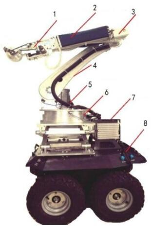

# 苹果自动采摘机器人项目总结

前言：研究生期间老板交给我的主要项目了，就算代码写得再怎么烂，总得留点记录以供之后回忆。

## 硬件组成



图中部件分别为：
1. 末端执行器 （中间嵌有摄像头）
2. Festo 气动推杆 
3. 小臂关节 
4. 大臂关节 
5. 台达伺服电机 
6. 腰部关节 
7. 台达 A2伺服驱动器 
8. 移动小车

其中Festo气动通过OPC通信连接，台达电机通过串口通信连接。

## 软件组成

软件部分上位机部分用MFC框架编写，运行在工控机的WindowsXP系统上，有使用opencv视觉库和OPC通信库。其具体运作逻辑如下所示：(虽然看起来逻辑简单，但是有好多细节问题没法表示)

```flow

st=>start: 开始自动采摘
e=>end: 采摘结束
op1=>operation: 苹果识别获取坐标
op2=>operation: 机械臂扫描
op3=>operation: 气动推杆推出
op4=>operation: 机械臂减速对准
op5=>operation: 割刀启动，夹手夹住
op6=>operation: 气动推杆收回，夹手松开
cond1=>condition: 是否检测到苹果
cond2=>condition: 光电门检测到物体或达到最大工作距离

st->op2->cond1
cond1(yes)->op4
op4->op3
op3->cond2
cond2(yes)->op5
cond2(no)->op3
op5->op6
op6->e
cond1(no)->op2


```

## 重要的细节点

整个工程一共有三个并行的线程，其中主线程1负责整体逻辑的控制，一个子线程2负责摄像头的读取与苹果的识别并在人机界面显示，一个子线程3负责使用电机控制机械臂完成末端执行器和苹果的对准。

+ 其中在主线程1中使用三个定时器实现对气动的控制和整体逻辑的控制。
	1. 定时器1：控制气动推出、抓手闭合和割刀启动。
	2. 定时器2：持续地读取气动推杆的绝对位置，从气动初始化之后一直运行，直到程序结束。
	3. 定时器3：控制抓手松开、电机线程重整的。
	（定时器的开关由一系列状态标志位控制）
+ 负责苹果识别的子线程2完成摄像头对图像的读取，苹果的识别（为整个流程提供目标中心坐标ex，ey），和画面的显示。
+ 负责电机控制的子线程3读取苹果的坐标(ex,ey)来实现抓手的位置校正。

整体系统中不同线程中公用的资源有一系列状态的标志位和目标的中心点坐标（ex，ey），并没有冲突的地方，所以没有用到锁，也就没有死锁的问题。
